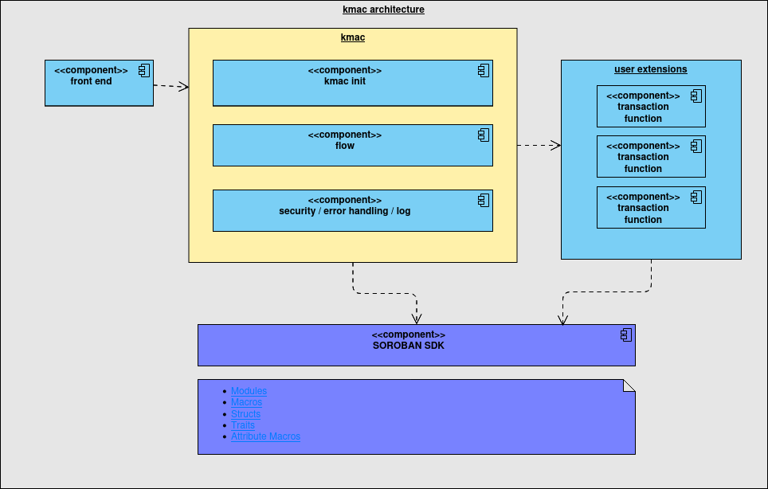

# kmac
# About this doc 
README.md Version November 08, 2023 12:14 
This is README.md file of the kmac project, at the main branch at https://github.com/huitemagico/kmac
IMPORTANT: This is an overview of the project!
You have to see the updated and detailed documentation in detail at 
https://github.com/huitemagico/kmac/wiki

# Introduction
 
## What is KMAC?
`@kmac` is a contract build with SOROBAN-SDK that makes an  implementation of an Finite State Machine template,  using knowed design pattern and providing extensible functions capabilities.  
[GitHub url](https://github.com/huitemagico/kmac)

# Usage:
## Environment setup 
  If you want to access a comprehensive documentation for installing all the necessary tools to run the program, 
  please refer to the KMAC wiki, chapter "For installing the environment from Zero",   
  at the following link:  
  [KMAC wiki] (https://github.com/huitemagico/kmac/wiki)

 ## Fast setup  
   The basic steps for setup and run kmac are the following:  

 1) cargo test  
 2) soroban contract build  
 3) identities setup: 
We need to set up some identities to use for testing and get their public keys:  

soroban config identity generate acc1 && \  
soroban config identity generate acc2 && \  
soroban config identity address acc1 && \  
soroban config identity address acc2  

 4) You must copy the string obtained and then insert in the runk1.sh script  

 Note about the shells: each kmac version (kmac1, kmac2, etc) could have updated shells for the respective kmac version.
 These are explained at the corresponding chapter at the
 KMAC wiki. Please refer to chapter title "Shells", at the kmac version.
 For example, for the kmac1 version (first deliverable)please see the chapter https://github.com/huitemagico/kmac/wiki#deliverable-1-about-the-shells 

soroban contract invoke \  
    --source acc1 \  
    --wasm target/wasm32-unknown-unknown/release-with-logs/echo2.wasm \  
    --id 1 \  
    -- \  
    echo2\  
     --user GCK3W6M5Z3W3JIHJ7M4MTKG4TH2TRMZRBFFKN3TTF6VFTFQYAN5RXPIM     \  
    --value 2 \  
    --message "reset" \  
    --trx "ab"  

 5) run the run0.sh (or the runk1.sh etc. see the explanation above)

## About the shells
 The following shells are basic development and test utility shell scripts. 
 compi.sh for compiling 
 bld.sh   for build 
 run0.sh  for run 
 (you must edit run0.sh with the identities obtained in the precedent paragraph)
 (see the above paragraph "Note about the shells")
 
# Deliverables
Note about the deliverables: The following paragraphs (deliverable 1, deliverable 2, etc.) represent the 'deliverables' documented in the offer document. In other words, these are the 'conditions of satisfaction' for the customer, in this case, the CSF team.

To view the updated documentation that explains 'how' each deliverable meets the 'conditions of satisfaction' (as well as any issues, problems, pending tasks, or new features) for each KMAC version (KMAC1, KMAC2, etc.), please refer to the corresponding chapter in the KMAC wiki
For instance, for "Deliverable 1" please see the chapter at link: https://github.com/huitemagico/kmac/wiki#deliverable-1-proof-of-concept-poc-for-design-pattern-implementation

## Deliverable 1: Proof of Concept (POC) for Design Pattern Implementation

Brief Description: Design, coding, and documentation of functional code components using soroban-sdk.    
This includes the following features: 

Security – Allow List Implementation & Role-Based Access Control  
Modularity – Implementation of internal and external functions (basic structure)  
Incorporating parametric components with declarative functionality to enable the use of extensible functions with component reuse.  
Testing of the previous modules  
How to measure completion:  
Code and tests available in https://github.com/huitemagico/kmac  
Announcement in Stellar Development Discord  
Documentation published in dev.to and on KMAC github repository  
Estimated date of completion: November 10 2023 (2 weeks from october 27, 2023)  

## Deliverable 2: Functional KMAC Program for Vending Machine Example (Sandbox)  
Brief Description: A soroban-sdk smart contract with hard-coded parameters that define states and transactions for the vending machine example.  
 The program is designed to accept transactions from a test module and respond with the new state. 
 Exception conditions are not handled in this version. 
How to Measure Completion: 
Code and tests available in https://github.com/huitemagico/kmac  
Announcement in Stellar Development Discord  
Documentation published in dev.to and on KMAC github repository  
Estimated Date of Completion: December 01 2023 (+3 weeks)  

## Deliverable 3: Documentation Manual for KMAC Usage
Brief Description: This document serves as a comprehensive manual that provides detailed instructions on working with the KMAC template. It  includes information on the various modules, setting new parameters for building different FSMs, reusing design pattern components, and extending  functionality. The document also discusses storage alternatives and considerations for network and stand-alone environments. 
How to Measure Completion: This deliverable will be posted in the GitHub repository of the KMAC project and announced in the Stellar discussion  chat.
Estimated Date of Completion: December 8 2023 (+1 week) 

